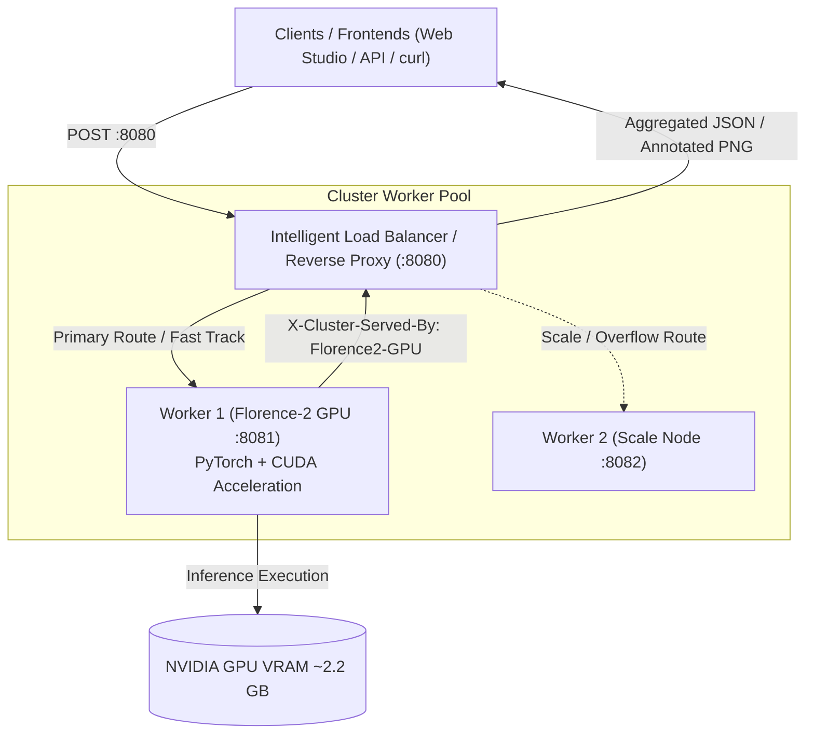

# SỔ TAY VẬN HÀNH KỸ THUẬT (TECHNICAL RUNBOOK)
## DỰ ÁN HỆ THỐNG GIÁM SÁT THỊ GIÁC & VISUAL GROUNDING (FLORENCE-2 COMMERCIAL EDITION)

Tài liệu này cung cấp toàn bộ hướng dẫn vận hành, cấu hình, triển khai, kiểm thử, giám sát và bảo trì hệ thống suy luận thị giác **Florence-2 Commercial Edition** dựa trên mô hình **Microsoft Florence-2-large (MIT License)** kết hợp kiến trúc **Mở rộng quy mô theo chiều ngang (Horizontal Scaling Cluster)**.

---

## 1. TỔNG QUAN HỆ THỐNG VÀ KIẾN TRÚC CỤM (CLUSTER ARCHITECTURE)

Hệ thống cho phép định vị đối tượng theo ngôn ngữ tự nhiên mở (Open-Vocabulary Object Detection & Visual Grounding) dựa trên mô hình Sequence-to-Sequence Vision Foundation **Microsoft Florence-2-large (776M parameters)** được cấp phép thương mại tự do (MIT License).

### 1.1. Sơ đồ kiến trúc Cụm phân tán



### 1.2. Cấu trúc cây thư mục hệ thống

```
locate-anything-florence2/
├── requirements.txt                    # Dependencies (torch, transformers, Pillow, fastapi...)
├── LICENSE                             # Giấy phép MIT toàn diện
├── README.md                           # Giới thiệu & hướng dẫn tổng quan
├── RUNBOOK.md                          # Sổ tay vận hành kỹ thuật (file này)
├── integration/
│   ├── florence_wrapper.py             # Thread-Safe Singleton Wrapper cho Florence-2
│   ├── api_server.py                   # FastAPI REST API Service (Endpoints chuẩn)
│   ├── load_balancer.py                # Intelligent Cluster Load Balancer & Dashboard Gateway
│   ├── edge_case_test.py               # Robustness & Edge-Cases Test Suite (8 kịch bản)
│   ├── concurrency_test.py             # Kiểm thử đồng thời tải cao
│   ├── memory_stability_test.py        # Kiểm tra ổn định bộ nhớ VRAM / RAM
│   ├── cluster_stress_test.py          # Kiểm thử cụm phân tán
│   └── static/                         # Frontend Web Studio (HTML/Canvas/JS Dashboard)
├── scripts/
│   ├── download_florence2.py           # Script tải mô hình Florence-2-large
│   ├── start_cluster.sh                # Script khởi chạy cụm dịch vụ nền
│   ├── run_cluster_daemon.sh           # Script chạy cụm daemon
│   ├── stop_cluster.sh                 # Dừng toàn bộ cụm dịch vụ
│   └── verify_all.sh                   # Script chạy toàn bộ test suite tự động
└── tests/
    └── fixtures/                       # Ảnh mẫu và test fixtures
```

---

## 2. QUY TRÌNH VẬN HÀNH DỊCH VỤ

### 2.1. Cài đặt môi trường
```bash
pip install -r requirements.txt
python3 scripts/download_florence2.py
```

### 2.2. Khởi chạy cụm (Production Cluster)
```bash
bash scripts/start_cluster.sh
```
- **Load Balancer**: `http://localhost:8080/`
- **Florence-2 Worker**: `http://localhost:8081/`
- **Trạng thái cụm**: `http://localhost:8080/cluster/status`

### 2.3. Dừng cụm
```bash
bash scripts/stop_cluster.sh
```

---

## 3. KIỂM THỬ VÀ ĐẢM BẢO CHẤT LƯỢNG (QA)

Thực thi kịch bản kiểm thử toàn diện 5 giai đoạn:
```bash
bash scripts/verify_all.sh
```
* **Giai đoạn 1**: Khởi động cụm Worker & Load Balancer, kiểm tra trạng thái `/ready`.
* **Giai đoạn 2**: Kiểm tra giao diện Web Studio (`GET /`) và API chỉ số cụm (`GET /cluster/status`).
* **Giai đoạn 3**: Kiểm tra nhận diện đối tượng thực tế (`POST /v1/locate`) với ảnh mẫu.
* **Giai đoạn 4**: Kiểm thử 8 kịch bản biên (Edge Cases: ảnh hỏng, file rỗng, prompt rỗng, đối tượng vắng mặt...).
* **Giai đoạn 5**: Kiểm thử sinh ảnh chú thích gắn nhãn bounding box (`POST /v1/locate/annotated`).

---

## 4. BẢN QUYỀN THƯƠNG MẠI (COMMERCIAL CLEARANCE)

* **Toàn bộ mã nguồn**: Được cấp phép theo giấy phép **MIT**.
* **Trọng số mô hình (Weights)**: `microsoft/Florence-2-large` được phát hành theo giấy phép **MIT** bởi Microsoft Corporation.
* **Không chứa bất kỳ thành phần hay trọng số nào thuộc giấy phép phi thương mại của NVIDIA**.
